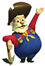

#  Prospector Implementation 

I implemented the seam carving maximimization algorithm as I described. The thought being of course that all ships should just navigate to those seams and then collect the most energy within those seams. 

I ran into some problems pretty quickly though since all the ships were fighting for constrained resources. They would collide and ultimately destroy each other. Oh the hubris!

There were other important elements of the game I was not accounting for either:

- Should I create a dropoff closer to where ships are to make it faster to collect halite?
- Should I only make a certain number of ships? Ships costs halite to build so every ship I build is halite I can't get back.

Where I landed then was Prospector:

```javascript
game.initialize().then(async () => {
    await game.ready('#TeamEric');

    logging.info(`My Player ID is ${game.myId}.`);

    while (true) {
        await game.updateFrame();

        const { gameMap, me } = game;
        const commandQueue = [];
        const dropOffCreator = new DropOffCreator();
        const shipCreator = new ShipCreator();
        const foreman = new Foreman();
        const retreater = new Retreater();
        const kamikaze = new Kamikaze();
        const prospector = new Prospector();
        let seams = [];
        let dropOffId = -1; //used to ensure ship doesn't get two commands

        //find muliple energy laden seams within the game map
        //need more than 1 to create entropy and get out of local maximums
        foreman.generateTopSeams(gameMap, me, seams);

        //if it makes sense to create a new dropoff from
        //an existing ship, do so.
        if (dropOffCreator.shouldCreateDropOff(game, me)) {
          let obj = dropOffCreator.makeDropOff(gameMap, me)
          dropOffId = obj.dropOffId;
          commandQueue.push(obj.command);
        }

        //every game turn we should tell every ship what to do
        for (const ship of me.getShips()) {

          // if ship has dropped off its halite for the final time
          // it should self destruct to make room for other ships
          if (kamikaze.shouldDestroyItself(game, ship)) {
            commandQueue.push(kamikaze.destroy(ship, gameMap));
          }

          // if ship is getting close to full capacity
          // retreat to nearest drop off location
          else if (retreater.shouldReturnToBase(ship, dropOffId, game)) {
            commandQueue.push(retreater.retreat(gameMap, me, ship));
          }

          // if the ships current game position has too little halite
          // should go to the nearest maximum seam location
          else if (prospector.shouldMoveToAnotherLocation(ship, dropOffId, gameMap)) {
            const entropy = Math.floor(Math.random() * constants.ENTROPY);

            // added periodic randomness to get out of local maximums
            if (entropy == 0) {
              const destination = me.shipyard.position;
              const safeMove = gameMap.naiveNavigate(ship, destination);
              commandQueue.push(ship.move(safeMove));
            }

            //find the best next position on the most maximized energy seam
            else {
              commandQueue.push(prospector.navigate(gameMap, ship, seams));
            }
          }

          // there is an implicit else here that says if it isn't time to go 
          // back and the ships current position has enough halite then just
          // stay still collecting halite
        }

        // this is an important turning mechanism. We should not just create 
        // ships just because we have enough halite to do so
        if (shipCreator.shouldCreateShip(game, me, gameMap)) {
            commandQueue.push(shipCreator.makeShip(me));
        }

        await game.endTurn(commandQueue);
    }
});
```
