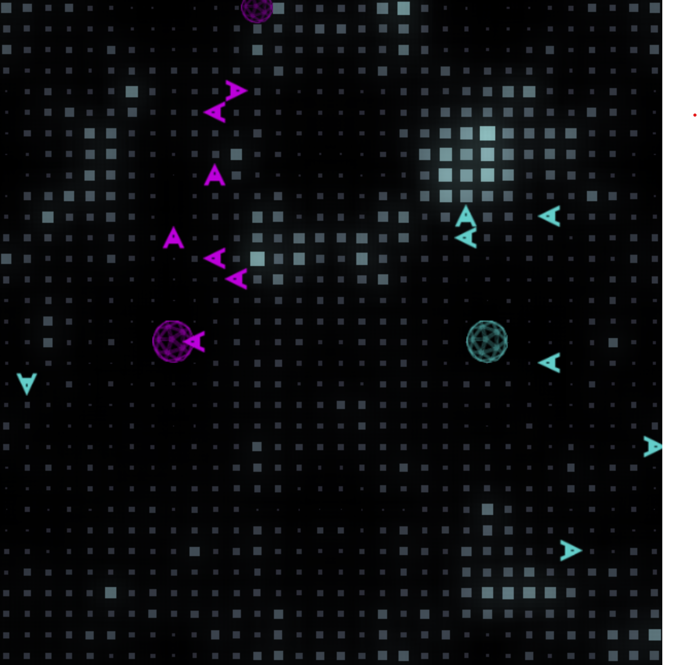
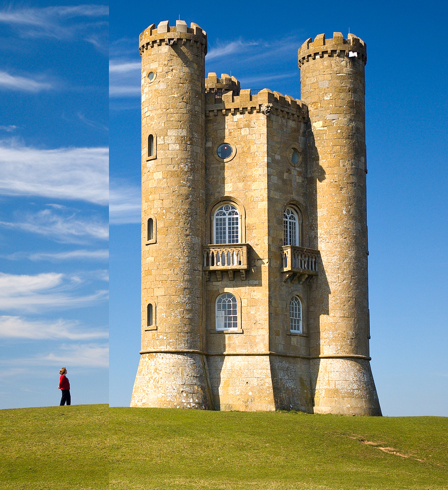
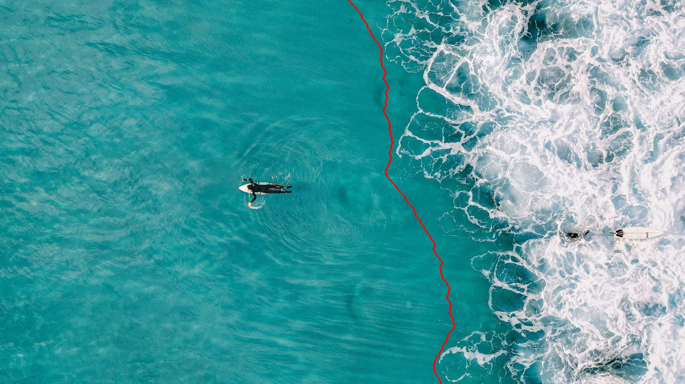

# Background

Keith and I have always had an interest in optimization and heuristic algorithms. This bot challenge can be solved a lot of different ways including

- Procedural algorithms
- Genetic algorithms
- Machine learning
- etc

I saw this as an optimization problem though. Ultimately

> Maximize the amount of halite collected within the given time frame

Fun.

---
So what does the map remind us of?

For me, I think "image". Its a grid of cells that contain some relative information to the overall system.

---

## Seam Carving
I had studied a previous algorithm called "Seam Carving" specific to image processing and while it is not an optimization algorith I saw how I could use it as part of my optimization algorithm.

Seam carving is an algorithm used to do "smart" cropping of images. Image you have an image like such

If you wanted to crop this you would end up cropping out the most interesting parts of the image. Really you want to crop out the section in the middle, but if you do that it can look... off.

Instead what seam carving does is it finds a the lowest energy seam and removes that.

> A seam is a set of colocated pixels that are connected throughout an entire image

> Energy is defined as the difference between corresponding pixels in an image.

Visualizing a low energy seam would look something like this

