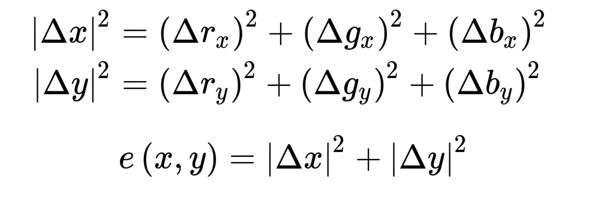
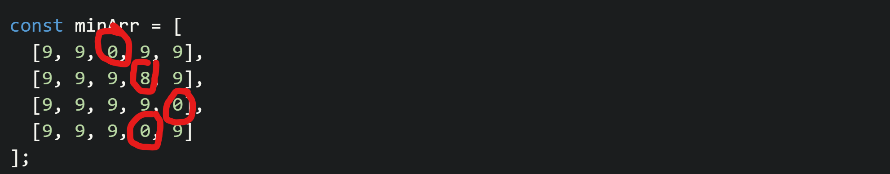

# Seam Carving Algorithm

> Source: https://medium.com/swlh/real-world-dynamic-programming-seam-carving-9d11c5b0bfca

The seam carving algorithm uses a branch of algorithms called dynamic programming. Dynamic programming essentially takes a problem and breaks it down into highly repeated subproblems. Recursion can often be a way to implement dynamic programming solutions.

## Energy Function
Seam carving is based on determining what "energy" means. Normally in an image this is done by computing the differences between Red, Green, and Blue between two pixels



In the case of the game map, this is a lot easier since energy is a scalar vs. a vector. We simply take the difference between two numbers.

## Finding Low Energy Seams

> A seam is sequence of pixels, exactly one per row. The requirement is that between two consecutive rows, the x coordinate can only vary by at most one. This keeps the seam connected.

> The lowest-energy seam is the one whose total energy across all the pixels in the seam is minimized.

Let's look at an example

```javascript
const minArr = [
  [9, 9, 0, 9, 9],
  [9, 9, 9, 8, 9],
  [9, 9, 9, 9, 0],
  [9, 9, 9, 0, 9]
];
```



## Algorithm

A greedy approach will not work because we need to find the lowest energy seam, not just the next lowest energy cell in the row.

Instead we should track the energy for each seam through the map. This suggests a subproblem approach or dynamic programming. If instead of selecting the next lowest energy pixel in the row we instead *select the item in the row that corresponds to the lowest energy seam*.

So the algorithm breaks down to

- For each top row pixel, the energy of the seam is just that pixel
- Go through each row and select the minimum energy seam from either the top left seam or top right seam or directly above.
- When we get to the bottom of the grid, just select the seam that has the lowest energy.

> Tactically for this to work as well you need to use pointers to track a seam back to its corresponding cells.

---

So for the bot I used a similar approach, and just used a maximization algorithm instead of a minimization algorithm.
